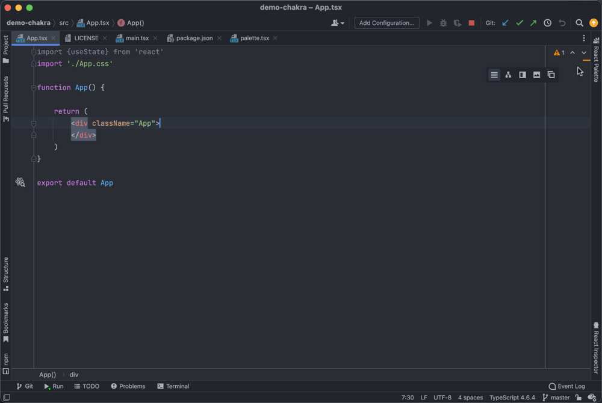

## [React Buddy](https://plugins.jetbrains.com/plugin/17467-react-buddy) demo palette of [Chakra UI](chakra-ui/chakra-ui) components

* Quickly observe available components and variants right in an IDE.
* Insert components using drag'n'drop or code generation action.

> This demo is actual for Chakra v2.x
> See the `chakra-v1` branch for the previous version

Currently, the following categories are fully covered:
* Layout
* Forms
* Data Display
* Feedback
* Typography
* Overlay
* Disclosure
* Navigation
* Media and Icons
